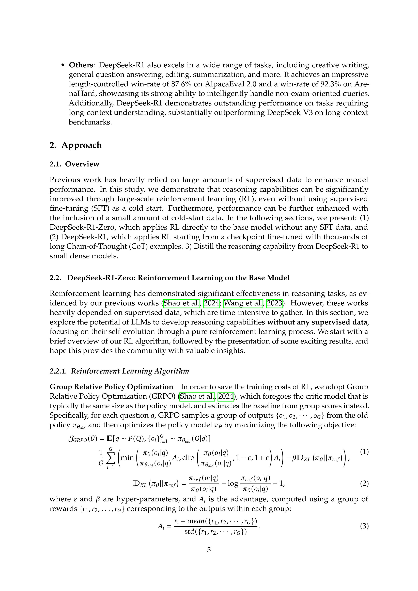
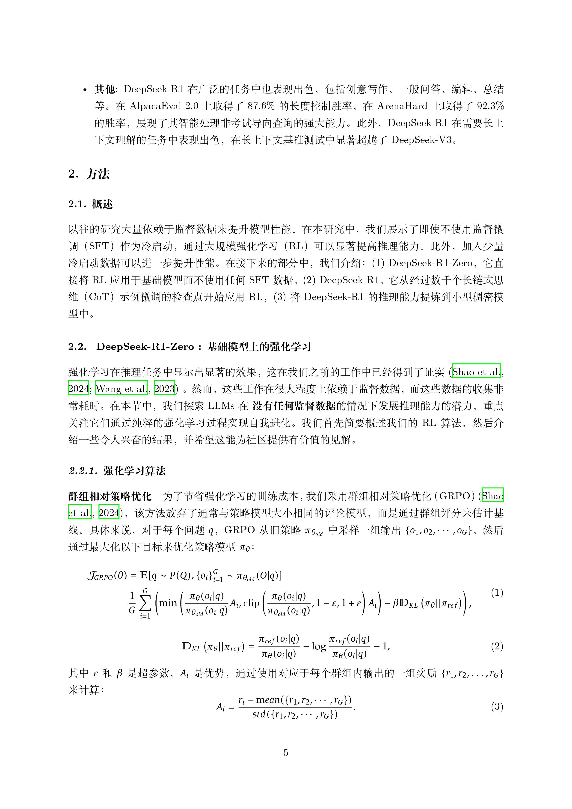
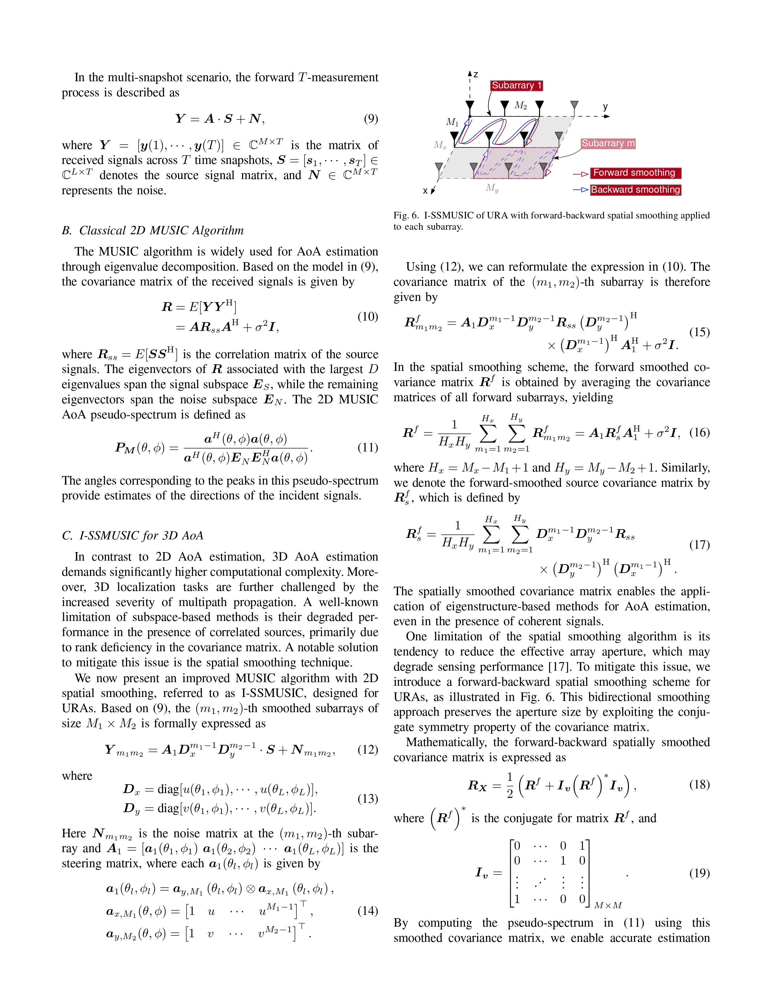
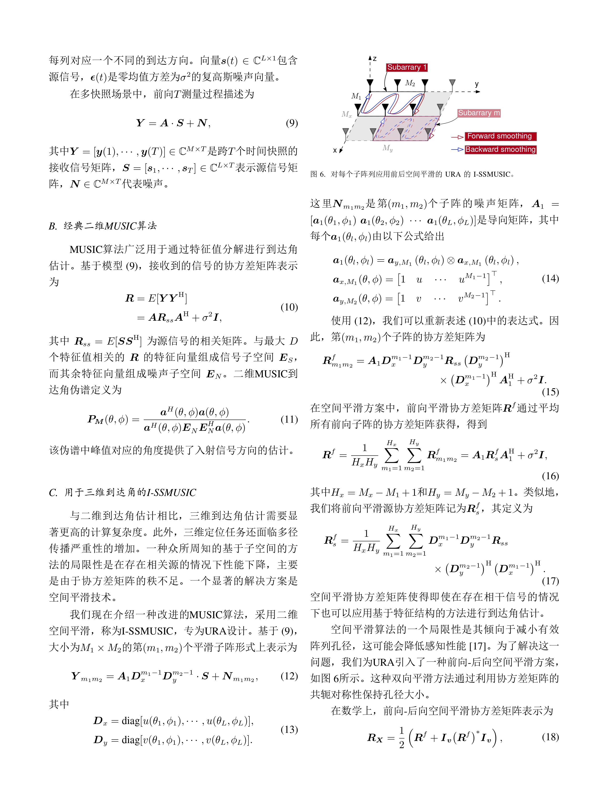

<div align="center">

English | [中文](README_ZH.md)


</img>

  **Turn arXiv Papers into Multilingual Masterpieces**
#
<!-- <p align="center">
  <a href="https://arxiv.org/abs/2503.06594" alt="paper"></a>
</p> -->

</div>

<div align="center">
<p dir="auto">

• 📖 [Introduction](#-introduction) 
• 🛠️ [Installation Guide](#️-installation-guide) 
• ⚙️ [Configuration](#️-configuration)
• 🐳 [Docker](#-docker)
• 📚 [Usage](#-Usage)
• 🖼️ [Translation Examples](#️-translation-examples) 

</p>
</div>

 End-to-end translation from arXiv paper ID to translated PDF. LaTeXTrans have the following **Features** :
 - **🌟 Preserve the integrity of formulas, layout, and cross-references**
 - **🌟 Ensure consistency in terminology translation**
 - **🌟 Support end-to-end conversion from original TeX source (automatically downloaded based on the arXiv paper id provided) to translated PDF**

With LaTeXTrans, researchers and students can obtain higher-quality arXiv paper translations without worrying about formatting confusion or missing content, thus reading and understanding arXiv papers more efficiently.

# 📖 Introduction

LaTeXTrans is a structured LaTeX document translation system based on multi-agent collaboration. It directly translates LaTeX code and generates translated PDFs with high fidelity to the original layout. Unlike traditional document translation methods (e.g., PDF translation), which often break formulas and formatting, LaTeXTrans leverages LLM to translate preprocessed LaTeX sources and employs a workflow composed of six agents—Parser, Translator, Validator, Summarizer, Terminology Extractor, and Generator to achieve the features. The figure below illustrates the system architecture of LaTeXTrans. 
<!-- For a more detailed introduction, please refer to our published paper 🔗 [LaTeXTrans: Structured LaTeX Translation with Multi-Agent Coordination](https://arxiv.org/abs/2508.18791). -->

<!-- </img> -->


# 🛠️ Installation Guide

#### 1. Clone Repository

```bash
git clone https://github.com/PolarisZZM/LaTeXTrans.git
cd LaTeXTrans
pip install -r requirements.txt
```

#### 2. Install MikTex(Recommended) or TeXLive

If you need to compile LaTeX files (e.g., generate PDF output), install [MikTex](https://miktex.org/download) or [TeXLive](https://www.tug.org/texlive/) !

 > [!IMPORTANT]
For MikTex, installation please be sure to select "install on the fly", in addition, you need to install additional [Strawberry Perl](http://strawberryperl.com/) support compilation.

# ⚙️ Configuration

This project no longer uses `config/default.toml`. All configuration is provided via environment variables.

Required (LLM):

- `LTX_BASE_URL` or `BASE_URL`: LLM API base URL (e.g. `https://api.deepseek.com/v1/chat/completions`)
- `LTX_API_KEY` or `API_KEY`: LLM API key
- `LTX_MODEL` or `MODEL`: model name (e.g. `deepseek-chat`)

Optional:

- `LTX_CONCURRENCY` or `CONCURRENCY`: concurrent translation requests (default `10`)
- `ARXIV_BASE_URL`: base domain for arXiv (default `https://arxiv.org`), set this if you use a mirror
- `LTX_TARGET_LANGUAGE` (default `ch`), `LTX_SOURCE_LANGUAGE` (default `en`)
- `LTX_MODE` (default `0`), `LTX_USER_TERM` (path or empty)
- `APP_PASSWORD`: password for logging into the web UI (required when using the Docker service UI)
- `JWT_SECRET` (default `dev-secret`), `TOKEN_TTL_SECONDS` (default `604800`)

Recommended base_url samples:

| Model | base_url |
|:-|:-|
| deepseek-chat | https://api.deepseek.com/v1/chat/completions |
| gpt-4o | https://api.openai.com/v1/chat/completions |
| gemini-2.5-pro | https://generativelanguage.googleapis.com/v1beta/openai/chat/completions |

# 🐳 Docker

Build the frontend+backend image:

```bash
docker build -t latextrans .
```

Run with environment variables:

```bash
docker run -p 8000:8000 \
  -e APP_PASSWORD=your_password \
  -e LTX_BASE_URL=https://api.deepseek.com/v1/chat/completions \
  -e LTX_API_KEY=sk-xxx \
  -e LTX_MODEL=deepseek-chat \
  -e LTX_CONCURRENCY=16 \
  -e ARXIV_BASE_URL=https://arxiv.org \
  latextrans
```

Then open `http://localhost:8000`, login with `APP_PASSWORD`, and submit arXiv IDs.

# 📚 Usage

###  Translation via ArXiv ID 

Simply provide an arXiv paper ID to complete translation:

```bash
# set envs for local CLI usage
export LTX_BASE_URL=...
export LTX_API_KEY=...
export LTX_MODEL=...
export LTX_CONCURRENCY=10

python main.py --arxiv 2508.18791
```

This command will:

1. Download the LaTeX source code from arXiv and extract it
2. Execute a workflow consisting of parsing, translation, refactoring and compilation
3. Save the translated LaTeX project and the compiled translation PDF in the outputs folder

 > [!NOTE]
Although LaTeXTrans supports translation from any language to any language, the current version has only made relatively complete compilation adaptations for translation from English to Chinese. When translating to other languages, the final output pdf may contain errors. We welcome you to raise an issue to describe the problem you have encountered, and we will solve it case by case.

<!-- # 🧰 Experimental Results

| System | COMETkiwi | LLM-score | FC-score | Cost |
|:-|:-:|:-:|:-:|:-:|
|NiuTrans |64.69|7.93|60.72|-|
|Google Translate |46.23|5.93|51.00|-|
|LLaMA-3.1-8b|42.89|2.92|49.40|-|
|Qwen-3-8b|45.55|7.87|48.68|-|
|Qwen-3-14b|68.18|8.76|65.63|-|
|DeepSeek-V3|67.26|**9.02**|63.68|$0.02|
|GPT-4o|67.22|8.58|58.32|$0.13|
|**LaTeXTrans(Qwen-3-14b)**|71.37|8.97|71.20|-|
|**LaTeXTrans(DeepSeek-V3)**|73.48|9.01|70.52|$0.10|
|**LaTeXTrans(GPT-4o)**|**73.59**|8.92|**71.52**|$0.35|

Note:
- **COMETkiwi** : a quality estimation model ([wmt22-cometkiwi-da](https://huggingface.co/Unbabel/wmt22-cometkiwi-da)) that reflects the quality of the translation, the higher the score, the better the translation quality.
- **LLM-score** : a method for evaluating the quality of translation using LLM (GPT-4o), the higher the score, the better the translation quality.
- **FC-score** : a method proposed in our paper to evaluate the formatting ability of LaTeX translation by detecting the number of errors in the compiled logs, the higher the score, the better the ability to maintain format.
- **Cost** : the average cost of translating each paper using the official API. -->
  


# 🖼️ Translation Examples

The following are three real translation examples generated by **LaTeXTrans**, with the original text on the left and translation results on the right.

### 📄 Case 1 ( en->ch ) :

<table>
  <tr>
    <td align="center"><b>Original</b></td>
    <td align="center"><b>Translation</b></td>
  </tr>
  <tr>
    <td></td>
    <td></td>
  </tr>
</table>

### 📄 Case 2 ( en->ch ):

<table>
  <tr>
    <td align="center"><b>Original</b></td>
    <td align="center"><b>Translation</b></td>
  </tr>
  <tr>
    <td></td>
    <td></td>
  </tr>
</table>

### 📄 Case 3 ( en->jp ):

<table>
  <tr>
    <td align="center"><b>Original</b></td>
    <td align="center"><b>Translation</b></td>
  </tr>
  <tr>
    <td></td>
    <td></td>
  </tr>
</table>

### 📄 Case 4 ( en->jp ):

<table>
  <tr>
    <td align="center"><b>Original</b></td>
    <td align="center"><b>Translation</b></td>
  </tr>
  <tr>
    <td></td>
    <td></td>
  </tr>
</table>


📂 **See [`examples/`](examples/) folder for more cases**, including complete translation PDFs for each case.

---
## Citation
```bash
@article{zhu2025latextrans,
  title={LaTeXTrans: Structured LaTeX Translation with Multi-Agent Coordination},
  author={Zhu, Ziming and Wang, Chenglong and Xing, Shunjie and Huo, Yifu and Tian, Fengning and Du, Quan and Yang, Di and Zhang, Chunliang and Xiao, Tong and Zhu, Jingbo},
  journal={arXiv preprint arXiv:2508.18791},
  year={2025}
}
